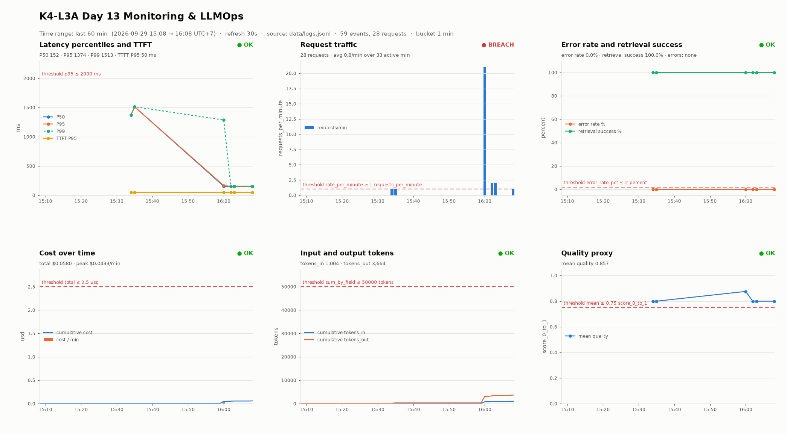

# Báo cáo cá nhân — K4-L3A Day 13 Monitoring & LLMOps

> Mỗi học viên hoàn thiện một file duy nhất này. Khi dẫn evidence, dùng đường dẫn tương đối, ví dụ `evidence/07-trace-waterfall.png`.
>
> Evidence và kết quả trong report thuộc commit bài làm ghi ở mục 1.

## 1. Thông tin học viên

- **Họ và tên:** Đàm Quang Trung
- **MSSV:** 2A202602525
- **Lớp:** K4-L3A
- **Repository URL:** https://github.com/trungdam1305/K4-L3A-DAY13-DamQuangTrung-2A202602525-Monitoring-LLMOps
- **Commit SHA cuối:** `bae306d2a9f1d597b68c18ca468c1e993bb20f7e` (commit bài làm; commit ngay sau chỉ ghi SHA này vào report. SHA nộp LMS là HEAD của `main`)
- **Challenge ID:** `day13-k4-l3a-monitoring-llmops-v1` (cohort K4, seed 1311; file `config/challenge.json` do Lab Coach gửi, được gitignore, không commit)
- **Tên project Langfuse cá nhân:** `day13-k4-l3a-2A202602525`

## 2. Evidence index

Output text được sinh trực tiếp từ `data/logs.jsonl` và Langfuse observations v2 API của project cá nhân; ảnh chụp Langfuse UI bổ sung cho các mục trace/prompt.

| Evidence | Đường dẫn |
|---|---|
| Baseline CP0 (trước khi sửa) | [`evidence/baseline/00-baseline-cp0.txt`](evidence/baseline/00-baseline-cp0.txt) |
| Pytest cuối | [`evidence/01-pytest.txt`](evidence/01-pytest.txt) |
| Log validator | [`evidence/02-log-validator.txt`](evidence/02-log-validator.txt) |
| Dashboard validator | [`evidence/03-dashboard-validator.txt`](evidence/03-dashboard-validator.txt) |
| Structured log | [`evidence/04-structured-log.txt`](evidence/04-structured-log.txt) |
| PII redaction | [`evidence/05-pii-redaction.txt`](evidence/05-pii-redaction.txt) |
| Trace list | [`evidence/06-trace-list.png`](evidence/06-trace-list.png) (29 root traces, filter `isRootObservation:true`), [`06-trace-list.txt`](evidence/06-trace-list.txt) |
| Trace waterfall | [`evidence/07-trace-waterfall.png`](evidence/07-trace-waterfall.png) (cây root → retrieval / prompt-resolve / generation), latency từng observation: [`07a-trace-observations-latency.png`](evidence/07a-trace-observations-latency.png) |
| Trace metadata | [`evidence/08a-trace-generation.png`](evidence/08a-trace-generation.png) (model, prompt day13-chat v1, TTFT, cost, tokens), [`evidence/08b-trace-metadata.png`](evidence/08b-trace-metadata.png) (lọc Langfuse theo `metadata.correlation_id = req-236bfcbf` của log; public key đã che), [`08-trace-metadata.txt`](evidence/08-trace-metadata.txt) |
| Prompt versions | [`evidence/09-prompt-versions.png`](evidence/09-prompt-versions.png) (v1 `production, baseline`; v2 `latest, candidate`), [`09-prompt-versions.txt`](evidence/09-prompt-versions.txt) |
| Prompt rollback | Trước: [`09`](evidence/09-prompt-versions.png) (production → v1) → sau promote: [`10a`](evidence/10a-prompt-after-promote.png) (production → v2) → sau rollback: [`10b`](evidence/10b-prompt-after-rollback.png) (production → v1); trace ID từng bước: [`10-prompt-rollback.txt`](evidence/10-prompt-rollback.txt) |
| Dashboard runtime | [`evidence/11-dashboard-overview.png`](evidence/11-dashboard-overview.png) ([số liệu](evidence/11-dashboard-overview.txt)); practice incidents: [`evidence/11b-dashboard-practice-incidents.png`](evidence/11b-dashboard-practice-incidents.png) |
| Incident metric | [`evidence/12-incident-metric.png`](evidence/12-incident-metric.png) (lúc sự cố), [`12b-incident-recovery.png`](evidence/12b-incident-recovery.png) (sau fix), số liệu [`12-incident-metric.txt`](evidence/12-incident-metric.txt), timeline [`12-incident-timeline.txt`](evidence/12-incident-timeline.txt) |
| Incident log | [`evidence/13-incident-log.txt`](evidence/13-incident-log.txt) |
| Incident trace | [`evidence/14-incident-trace.png`](evidence/14-incident-trace.png) (trace `17ed0b7d…`: `rag-retrieval` 2.50s / root 2.65s), [`14-incident-trace.txt`](evidence/14-incident-trace.txt) |

## 3. Kết quả kỹ thuật

| Nội dung | Baseline | Kết quả cuối | Nhận xét |
|---|---|---|---|
| `validate_logs.py` | 30/100 (20 record thiếu field, 20 thiếu enrichment, 0 correlation ID) | 100/100 (129 record, 61 correlation ID, gồm cả CP3) | Log baseline được chuyển ra ngoài trước khi đo lại |
| `validate_dashboard.py` | 6/6 | 6/6 | Validator chỉ kiểm contract; dashboard runtime xem mục 6 |
| `pytest` | 22 passed | 37 passed | +15 test: PII (CCCD, thẻ, passport, 84-prefix, multi-PII), correlation header, context leak, scrub nested, prompt warm-up (kể cả khi SDK trả fallback) |
| Số traces hợp lệ | 0 (chưa có key) | 53 trace trong project (29 ở CP2 + 24 ở CP3), 52 trace có đủ root + retriever + generation | 6 trace mất hẳn và 1 trace thiếu span trong đợt baseline 12:52Z do export timeout vì mạng chập chờn; xem mục 8 |
| Số PII leak | 0 (starter đã dùng `summarize_text` cho payload) | 0 trong log, 0 trong Langfuse | Quét toàn bộ input/output/metadata của 208 observation bằng detector của `validate_logs.py` |
| Latency P95 / TTFT P95 | ~155 ms / 50 ms | 1374 ms / 50 ms (cửa sổ 60 phút) → first request sau fix: 153 ms | P95/P99 bị kéo lên bởi 3 request cold-start; đã tìm ra và sửa, xem mục 8 |
| Retrieval success rate | 100% | 100% | Practice `tool_fail`: giảm còn 80.4% ([11b](evidence/11b-dashboard-practice-incidents.png)) |

## 4. Logging và PII

- **Cách tạo/nhận và truyền correlation ID:** [`app/middleware.py`](../app/middleware.py) gọi `clear_contextvars()` đầu mỗi request. Nếu header `x-request-id` đúng format `req-<8-hex>` thì dùng nguyên giá trị đó, ngược lại sinh `req-{uuid4().hex[:8]}`. ID được bind vào structlog contextvars, gán vào `request.state` (agent đưa vào trace metadata) và trả lại qua header `x-request-id` cùng `x-response-time-ms`. Header sai format bị thay bằng ID mới vì giá trị client gửi có thể chứa PII hoặc ký tự lạ, và sẽ đi thẳng vào mọi dòng log.
- **Các metadata được ghi vào structured log:** [`app/main.py`](../app/main.py) bind `user_id_hash` (SHA-256 12 ký tự, không lưu user_id thô), `session_id`, `feature`, `model`, `env` **trước** `request_received`, nên mọi dòng log sau đó của request đều có đủ context. `response_sent` có thêm `latency_ms`, `ttft_ms`, `tokens_in/out`, `cost_usd`, `quality_score`, `tool_name/tool_success` và `trace_id` (Langfuse), để đi thẳng từ log sang trace. Ví dụ: [`04-structured-log.txt`](evidence/04-structured-log.txt).
- **Cách bảo đảm PII được scrub trước khi ghi:** trong [`app/logging_config.py`](../app/logging_config.py), `scrub_event` đứng sau `format_exc_info` (để che cả PII trong traceback) và trước `JsonlFileProcessor`/`JSONRenderer`. Scrubber duyệt đệ quy mọi string trong event (dict/list lồng nhau), không chỉ `payload`. Pattern trong [`app/pii.py`](../app/pii.py) gồm: email, thẻ 16 số/Amex 15 số, CCCD 12 số, điện thoại VN (`0`/`+84`/`84`, có space/dot/dash), hộ chiếu VN. Thẻ và CCCD được che trước điện thoại để không bị che dở dang. Phía Langfuse, mọi observation dùng `capture_input/output=False` và chỉ gửi bản đã scrub.
- **Cách kiểm chứng kết quả:**
  - `validate_logs.py` dùng bộ detector độc lập với code của tôi và báo 0 leak.
  - [`05-pii-redaction.txt`](evidence/05-pii-redaction.txt) đặt cạnh nhau input chứa PII giả (lấy từ dữ liệu test của repo) và dòng log đã che; kèm input generation trên Langfuse của trace `3f678d0fbcf43bd47826c673da6bdd0f`, trong đó cả 4 loại PII đều đã bị che.
  - Test [`tests/test_correlation_logging.py`](../tests/test_correlation_logging.py) assert rằng không giá trị PII nào xuất hiện trong file log.

## 5. Tracing và prompt versioning

- **Cách xác nhận traces do chính tôi tạo trong project cá nhân:** key trong `.env` thuộc project `day13-k4-l3a-2A202602525`. Mọi trace đều do workload tôi chạy (`scripts/load_test.py` và các request thử prompt). Mỗi `trace_id` trong [`06-trace-list.txt`](evidence/06-trace-list.txt) đều khớp một dòng `response_sent` trong `data/logs.jsonl` qua `correlation_id`. Danh sách được đọc lại từ Langfuse API, không tự ghi tay.
- **Cấu trúc root/retrieval/generation observations:** root `lab-agent-run` (AGENT) → các con `rag-retrieval` (RETRIEVER, [`app/mock_rag.py`](../app/mock_rag.py)), `prompt-resolve` (SPAN, [`app/prompt_management.py`](../app/prompt_management.py)) và `llm-generation` (GENERATION, [`app/mock_llm.py`](../app/mock_llm.py)). Generation có `model`, `usage_details` (input/output tokens), `cost_details` (input/output/total USD, cùng hàm giá với `cost_usd` trong log), `completion_start_time` (Langfuse tính TTFT ≈ 0.051 s) và prompt link qua `propagate_attributes(prompt=...)`. Xem [`08-trace-metadata.txt`](evidence/08-trace-metadata.txt).
- **Cách nối trace với log:** `correlation_id` nằm trong metadata của mọi observation (propagate từ root) và trong mọi dòng log; `response_sent` còn ghi `trace_id`. Ví dụ: log `req-a16b21a2` (session `s01`) ↔ trace `da5deef8b53032095a14ced9c14d06e9`.
- **Prompt name:** `day13-chat`
- **Version/label baseline:** v1 — labels `baseline`, `production`; template gốc (3 biến `feature/docs/message`).
- **Version/label candidate:** v2 — label `candidate`; thêm dòng "Answer in at most 3 concise bullet points, using only the Docs above."
- **Trace ID của mỗi version (cùng input "Explain why metrics traces and logs work together"):**
  - `LANGFUSE_PROMPT_LABEL=baseline` → v1: `3316b601cefd5abcdb665c5005872928` (`req-cfb7dbc4`)
  - `LANGFUSE_PROMPT_LABEL=candidate` → v2: `4b18a119501f5ad60e2b1d12449ac6a2` (`req-66858919`)
- **Cách promote và rollback `production`:** dùng [`scripts/prompt_versions.py`](../scripts/prompt_versions.py) (`update_prompt`; label là duy nhất giữa các version nên `production` tự chuyển). API **không restart**. Evidence: [`10-prompt-rollback.txt`](evidence/10-prompt-rollback.txt).
  1. Trước promote, `production` → v1: `3c34da020d24331fed18d5fb85ce6d3f`.
  2. `promote 2`: request đầu sau khi hết cache TTL vẫn là v1 (`f47acaa81e6e01a596c70e6dd791f2d9`), request kế tiếp là v2 (`c5d9c1ca17f8e517f481b400fb1820a3`).
  3. `rollback 1`: tương tự, v2 stale (`d05eb76a81b4bbd0239aabe90f9f0099`), rồi v1 (`e69f3fe346003a4957b3a5ff304db52a`).
  4. Trạng thái cuối: v1 = `baseline, production`; v2 = `candidate, latest`.
  - Nhận xét: SDK cache prompt 60 s theo kiểu stale-while-revalidate, nên đổi label **không có hiệu lực tức thì**. Có một khoảng tối đa TTL + 1 request vẫn dùng version cũ; khi rollback khẩn cấp cần tính khoảng này, hoặc restart để xóa cache.

## 6. Dashboard, SLO và alerts

- **Dashboard và sáu panel:** [`scripts/build_dashboard.py`](../scripts/build_dashboard.py) đọc `data/logs.jsonl` và render đúng 6 panel theo [`config/dashboard.yaml`](../config/dashboard.yaml).
  - Tiêu đề, đơn vị và threshold lấy trực tiếp từ contract; time range 60 phút, bucket 1 phút; `--watch` render lại mỗi 30 giây.
  - Mỗi panel có dòng tóm tắt toàn cửa sổ và trạng thái OK/BREACH so với threshold. Percentile dùng chung hàm `app.metrics.percentile` với endpoint `/metrics`.
  - Ảnh [`11-dashboard-overview.png`](evidence/11-dashboard-overview.png) (workload có trace): P50 152 ms, P95 1374 ms, TTFT P95 50 ms, error 0%, retrieval 100%, cost $0.058, tokens in/out 1004/3664, quality 0.857. Traffic báo BREACH (0.84 req/phút < 1) vì lab chỉ gửi traffic theo đợt; đây là số thật, không chỉnh ngưỡng.
  - Ảnh [`11b`](evidence/11b-dashboard-practice-incidents.png) là lần chạy practice `rag_slow` → `cost_spike` → `tool_fail`: P95 lên 2653 ms (TTFT không đổi), error rate 19.6% với breakdown `RuntimeError=10`, retrieval success 80.4%, tokens_out tăng vọt ở phút `cost_spike`.
- **SLO và lý do chọn:** [`config/slo.yaml`](../config/slo.yaml): 99.5% request thành công và `latency_ms ≤ 2000` trong 28 ngày.
  - Tôi hạ ngưỡng từ 3000 ms xuống 2000 ms theo baseline đo được (P50 ~152 ms, P95 ~155 ms). 2000 ms vẫn dư > 10x headroom nhưng bắt được sự cố retrieval chậm (~2650 ms/request); với 3000 ms, SLO không nhìn thấy `rag_slow`.
  - Threshold P95 trong dashboard đổi theo để SLO line khớp với SLO.
- **Cách tính error budget:**
  - Budget = (1 − 0.995) × tổng request = 0.5%. Ví dụ 1000 request/ngày → 28 000 request/28 ngày → được phép 140 request xấu.
  - Burn rate = tỷ lệ xấu quan sát / 0.005.
  - Trong lần practice (51 request: 10 chậm do `rag_slow` + 10 lỗi do `tool_fail`), tỷ lệ xấu là 39% → burn rate ≈ 78x, tức cạn budget 28 ngày trong khoảng 8.6 giờ. Mức này vượt ngưỡng fast-burn 14.4x nên phải page.
- **Ba alert và runbook tương ứng:** [`config/alert_rules.yaml`](../config/alert_rules.yaml) và [`docs/alerts.md`](../docs/alerts.md):
  1. `chat_latency_p95_slo_breach` — P95 > 2000 ms / 5m, duration 5m, P2, Slack `#day13-k4-l3a-oncall`.
  2. `chat_error_rate_high` — error rate > 2% / 5m và ≥ 10 request, duration 2m, P1, Slack `#day13-k4-l3a-oncall`.
  3. `chat_cost_per_request_spike` — avg cost/request > 0.005 USD / 15m (≈ 2.4x baseline) hoặc tổng 60m > 2.5 USD, duration 15m, P3, Slack `#day13-k4-l3a-finops`.

## 7. Điều tra challenge

- **Challenge ID:** `day13-k4-l3a-monitoring-llmops-v1` (K4, seed 1311). Chạy đúng hai lệnh `python scripts/inject_incident.py` và `python scripts/load_test.py --challenge --concurrency 5`. Timeline từng bước: [`12-incident-timeline.txt`](evidence/12-incident-timeline.txt).
- **Khoảng thời gian điều tra:** 2026-09-29 **12:56:01Z → 12:56:18Z** (19:56:01–19:56:18 UTC+7), từ lúc inject tới khi load test challenge kết thúc. Baseline đối chứng: 12:55:10–12:55:14Z. Kiểm chứng sau fix: 12:58:00–12:58:03Z.
- **Triệu chứng từ metrics:** ([`12-incident-metric.png`](evidence/12-incident-metric.png), [`12-incident-metric.txt`](evidence/12-incident-metric.txt))
  - Panel **Latency percentiles and TTFT** báo BREACH: **P95 tăng từ 161 ms lên 2654 ms**, vượt SLO line 2000 ms ở phút 12:56Z. 5/5 request có `latency_ms > 2000`.
  - **TTFT P95 giữ nguyên 50 ms.** Error rate vẫn 0%, retrieval success vẫn 100%, cost/tokens/quality bình thường.
  - Kết luận từ metrics: request chậm nhưng không lỗi, và LLM vẫn trả token đầu nhanh, nên thời gian bị tiêu ở một bước *trước* generation.
- **Log line và correlation ID liên quan:** ([`13-incident-log.txt`](evidence/13-incident-log.txt)) lọc `event == "response_sent" and latency_ms > 2000` trong cửa sổ sự cố thì được 5 dòng, tất cả `feature = "monitoring"` (đúng `affected_feature`), `latency_ms` 2653–2654, `ttft_ms` 50. Request được chọn là **`req-628ce44b`** (session `k4-l3a-challenge-s02`):
  `{"service": "api", "latency_ms": 2653, "ttft_ms": 50, ..., "tool_name": "retrieval", "tool_success": true, "trace_id": "17ed0b7d89dd5f2710210a359bb75ab1", "event": "response_sent", "feature": "monitoring", ..., "correlation_id": "req-628ce44b", ..., "ts": "2026-09-29T12:56:07.227486Z"}`
- **Trace ID và span gây ảnh hưởng:** trace **`17ed0b7d89dd5f2710210a359bb75ab1`**. Mở từ `trace_id` trong log, hoặc lọc Langfuse theo `metadata.correlation_id = req-628ce44b`. ([`14-incident-trace.txt`](evidence/14-incident-trace.txt))
  - Root `lab-agent-run` 2654 ms; **`rag-retrieval` 2501 ms (94%)**; `llm-generation` 151 ms; `prompt-resolve` 0 ms.
  - Cả 5 trace challenge đều cùng mẫu (retrieval 2501 ms), trong khi retrieval ở baseline chỉ 0–1 ms.
- **Root cause:** bước retrieval (vector store / RAG backend) bị chậm khoảng 2.5 s mỗi lần gọi (incident `rag_slow` trong file challenge). Ba lớp bằng chứng cùng chỉ về một chỗ:
  - metric: latency tăng nhưng TTFT, error và cost không đổi;
  - log: mọi request chậm đều là `feature=monitoring` với `latency_ms` khoảng 2653;
  - trace: span `rag-retrieval` chiếm 94% duration.
  - LLM và prompt fetch không liên quan.
  - Tác động phía người dùng còn nặng hơn: `/chat` là `async def` nhưng gọi retrieval đồng bộ nên chặn event loop. 5 request đồng thời bị xếp hàng, latency phía client lên **8.0–13.3 s** dù mỗi request chỉ tốn 2.65 s phía server.
- **Fix action:**
  - Khôi phục retrieval backend (`python scripts/inject_incident.py --disable` lúc 12:58:00Z), rồi chạy lại **đúng 5 query challenge**.
  - Kết quả: P95 152 ms, 0/5 request > 2000 ms; trace sau fix `5609ce896c387f6b464e3f67f59ea4bc` có `rag-retrieval` 1 ms ([`12b-incident-recovery.png`](evidence/12b-incident-recovery.png)).
  - Fix ở tầng code nên làm tiếp: đặt timeout cho retrieval (vd. 800 ms), quá hạn thì trả fallback docs hoặc cache. Khi đó vector store chậm chỉ làm giảm chất lượng câu trả lời chứ không kéo latency vượt SLO.
- **Preventive measure:**
  1. Alert `chat_latency_p95_slo_breach` (P95 > 2000 ms trong 5 phút, [`config/alert_rules.yaml`](../config/alert_rules.yaml)) sẽ page on-call. Runbook [Alert 1](../docs/alerts.md#alert-1) đã có sẵn đúng các bước điều tra ở trên: so TTFT, lọc log, rồi so duration `rag-retrieval` và `llm-generation`.
  2. Thêm timeout + circuit breaker + cache cho retrieval, kèm metric chẩn đoán P95 của span `rag-retrieval` lấy từ trace.
  3. Đưa lời gọi agent ra khỏi event loop (endpoint `def` chạy trong threadpool, hoặc retrieval client async), để một dependency chậm không làm tất cả request đồng thời phải xếp hàng.
  4. Đưa kịch bản `rag_slow` vào load test định kỳ/CI và assert alert latency có bắn, để phát hiện sớm khi thay đổi retrieval.

## 8. Giải thích và tự đánh giá

- **Một quyết định kỹ thuật quan trọng và lý do:**
  - Tôi đặt instrumentation retriever/generation ngay tại `retrieve()` và `FakeLLM.generate()` bằng `@observe(as_type=...)`, thay vì bọc trong `LabAgent.run`. Nhờ vậy mọi nơi gọi hai hàm này đều có span, root span giữ nguyên hợp đồng mà `test_agent_prompt_trace` kiểm tra, và cost trong trace với cost trong log dùng chung một hàm giá (`cost_details`), không bị lệch.
  - Tôi cũng tách bước lấy prompt thành span `prompt-resolve`. Nếu không có span này, waterfall có một khoảng trống không giải thích được giữa retrieval và generation.
- **Một lỗi/blocker đã gặp:**
  1. Dashboard sau khi có tracing cho thấy **P95 1374 ms, P99 1513 ms dù không bật incident nào**.
  2. `GET /api/public/traces/{id}` trả 410 `LEGACY_API_UNAVAILABLE_FOR_NEW_ORGANIZATION` với organization Langfuse mới tạo.
  3. Trong dashboard, dict threshold có key `value` ghi đè giá trị đo được, nên panel luôn báo OK.
  4. Khi chụp metadata trên Langfuse, SDK tự gắn `scope.attributes.public_key` vào mọi observation, nên screenshot cột Metadata làm lộ public key.
  5. Ở CP3, mạng tới `cloud.langfuse.com` chập chờn (bắt tay TLS 0.7–3 s, có request 9 s). Log API có `Failed to export spans batch ... Read timed out (read timeout=5.0)`, và request đầu tiên vẫn chậm 1589 ms dù đã warm-up.
- **Cách tìm nguyên nhân và xử lý:**
  1. Tôi đi đúng luồng Metrics → Logs → Traces:
     - *Metrics:* panel latency có tail cao nhưng TTFT không đổi.
     - *Logs:* chỉ 3 request có `latency_ms > 500` (`req-cfb7dbc4` 1374 ms, `req-66858919` 1513 ms, `req-236bfcbf` 1287 ms), đều là request **đầu tiên sau mỗi lần khởi động API**.
     - *Trace:* `3c34da020d24331fed18d5fb85ce6d3f` cho thấy span `prompt-resolve` chiếm **1134 / 1288 ms**, trong khi retrieval 0 ms và generation 152 ms.
     - *Root cause:* lần fetch prompt đầu tiên tới Langfuse bị cache miss.
     - *Fix:* `warm_prompt_cache()` trong lifespan của app. Sau fix, request đầu tiên sau restart chỉ còn **153 ms** (`req-c98bffe2`, trace `e9c5d6a5df297a8a702b853b5a00207e`).
  2. Chuyển sang `GET /api/public/v2/observations` (`client.api.observations.get_many`) theo hướng dẫn trong response lỗi.
  3. So số tóm tắt với phép tính tay, thấy giá trị trùng khít threshold; đổi thành key `current`.
  4. Che các dòng chứa key trong ảnh trước khi lưu evidence (`08b`), và kiểm tra lại mọi screenshot Langfuse trước khi commit. Public key đơn lẻ không đủ để ghi dữ liệu, và ảnh gốc chưa từng rời máy nên không cần rotate key.
  5. Log API cho thấy `get_prompt` lỗi ở bước bắt tay SSL rồi SDK **âm thầm trả prompt fallback**, trong khi `warm_prompt_cache` vẫn báo thành công vì SDK không raise. Tôi sửa warm-up để kiểm tra `is_fallback` và thử lại tối đa 3 lần (có test), rồi chạy API với `LANGFUSE_TIMEOUT=20` (ghi trong `.env.example`). Sau đó không còn lỗi export nào, và mọi trace của challenge đều đầy đủ. 6 trace của đợt baseline 12:52Z đã mất thì không lấy lại được; tôi ghi nhận chứ không chạy bù để che.
- **Cách hiểu luồng Metrics → Logs → Traces:**
  - Metrics cho biết *có vấn đề gì và từ lúc nào* (vd. P95 vượt ngưỡng, TTFT không đổi).
  - Logs trong khoảng thời gian đó cho biết *request nào bị ảnh hưởng* (`correlation_id`, feature, latency, `trace_id`).
  - Trace của đúng request đó cho biết *bước nào gây ra* (span nào chiếm phần lớn duration hoặc có level ERROR).
  - Chỉ kết luận khi cả ba lớp chỉ về cùng một nguyên nhân, như ví dụ cold-start ở trên.
- **Vai trò của prompt version, token/cost, SLO hoặc rollback trong vận hành LLM:**
  - *Prompt version:* đổi prompt cũng là một lần deploy. Nhờ trace gắn prompt name/version/label, mọi thay đổi latency/cost/quality đều quy được về một version cụ thể. Ví dụ v2 thêm 18 input tokens mỗi request (32 → 50).
  - *Rollback:* chỉ là đổi label, không cần redeploy code, nhưng có độ trễ theo cache TTL.
  - *Token/cost:* là "latency của ví tiền". Cost/request tăng mà traffic không tăng là tín hiệu prompt/model thay đổi hoặc output phình ra (`cost_spike` tăng tokens_out 4x).
  - *SLO + error budget:* quyết định khi nào được phép thử prompt mới và khi nào phải freeze rồi rollback.
- **Điều quan trọng nhất đã học:**
  - Observability chỉ có giá trị khi ba lớp tín hiệu nối được với nhau bằng cùng một ID. Ở CP3, dashboard chỉ nói "P95 vượt 2000 ms"; log nói "request `req-628ce44b`, feature `monitoring`, TTFT bình thường"; phải có span con trong trace mới thấy retrieval chiếm 94% thời gian. Với root span duy nhất như starter, tôi chỉ biết request chậm chứ không biết vì sao.
  - Độ chi tiết của span quyết định khả năng chẩn đoán. Span `prompt-resolve` được thêm vào chỉ vì waterfall có một khoảng trống không giải thích được, và chính nó làm lộ lỗi cold-start 1.1 s mà metric tổng không giải thích nổi.
  - Bản thân công cụ quan sát cũng là một dependency có thể hỏng. SDK Langfuse âm thầm trả prompt fallback và làm rớt span khi mạng chậm. Phải kiểm tra chính đường telemetry (log lỗi export, số trace kỳ vọng so với số trace thực tế) thay vì coi "không thấy lỗi" là ổn, và ghi nhận trung thực phần dữ liệu đã mất.
- **Hạn chế hoặc phần chưa hoàn thành, nếu có:**
  - Endpoint `/chat` là `async def` nhưng gọi agent đồng bộ (`time.sleep`), nên chặn event loop. Với concurrency 5, latency phía client (~780 ms, 10–13 s khi `rag_slow`) cao hơn nhiều so với `latency_ms` đo trong agent.
  - Dashboard dựa trên `latency_ms` nên không thấy phần thời gian xếp hàng này. `x-response-time-ms` trong header có ghi lại nhưng chưa được đưa vào log.
  - Dashboard là ảnh PNG render từ log, không phải UI tương tác.

## 9. Checklist trước khi nộp

- [x] Kết quả và evidence thuộc commit SHA cuối.
- [x] Tất cả ảnh/output mở được bằng đường dẫn tương đối.
- [x] Incident evidence nối đúng metric → log → trace.
- [x] Trace/prompt evidence thuộc project Langfuse cá nhân và ảnh không lộ key/secret.
- [x] Repository chạy lại được theo README.
- [x] Không có secret, API key, PII thô hoặc evidence của người khác/lớp khác.
- [ ] URL repo và commit SHA cuối đã được nộp trên LMS/Codelabs.
